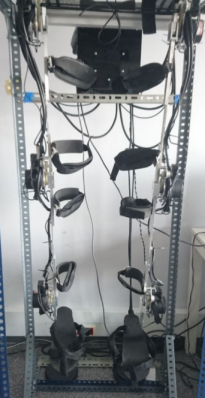
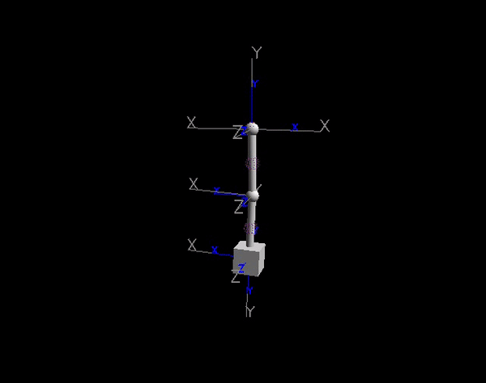
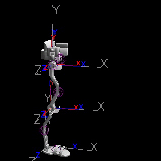
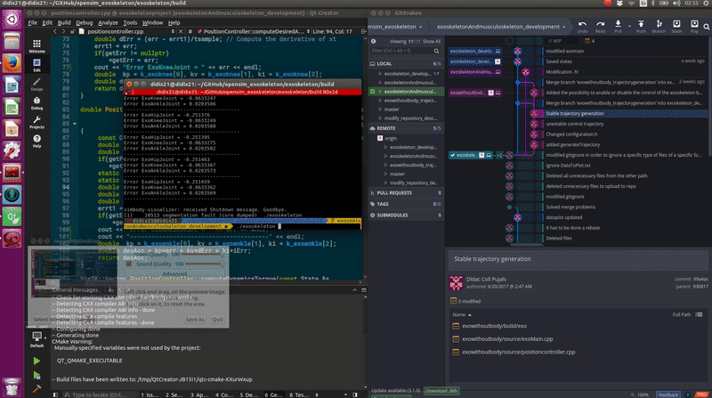
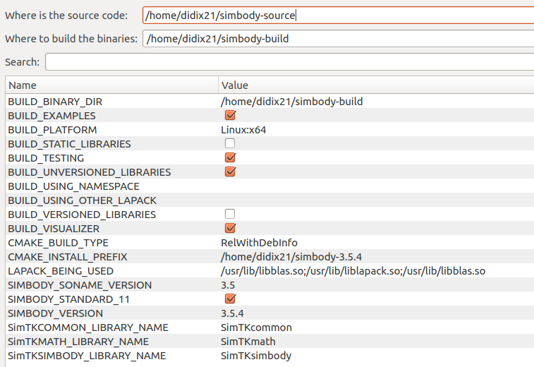

# opensim_exoskeleton

This repository aims to make use of OpenSim API and Simbody API, two C++ libraries in order to prove the feasibility of coupling and simulating the H1 exoskeleton model with a musculoskeletal model already created in OpenSim. The following images show the H1 Exoskeleton and the OpenSim model:

 

## Description

In this repository you will find an double pendulum example created in OpenSim, the H1 Exoskeleton designed in OpenSim, and the H1 Exoskeleton coupled to the "leg6dof9musc" OpenSim model.

### Double Pendulum

### H1 Exoskeleton

### H1 Exoskeleton coupled to leg6dof9musc OpenSim model

## Prerequisits

* **Simbody 3.5.4**
* **OpenSim 3.3**

In order to build Simbody & OpenSim from source, follow the instructions that you can find [here](https://simtk-confluence.stanford.edu/display/OpenSim/Building+OpenSim+from+Source).

Both libraries have to be builded with **C++11** option.

### 
